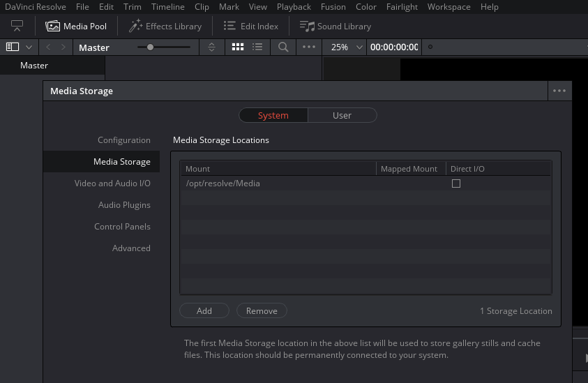

(update: 15.2.4)

# Introduction

Blackmagics [DaVinci Resolve](https://www.blackmagicdesign.com/products/davinciresolve/) is a very powerful video postproduction software. It's a closed source commercial product, but beside the full blown "studio"-edition there is also a freely downloadable variant available, which looks quite usable and sufficient for daily use. Significant improvements of Version 15 (e.g. native system audio support on the linux platform) finally let it become it a very attractive alternative for video related work on linux desktops too.

Although the software is in principle available on all common platforms, its Linux support doesn't look very satisfying or impressive. It only supports one specific kind of Linux distribution -- namely: CentOS --, and even on this particular kind of Linux it official installer doesn't come with sufficient uninstall capabilities etc.

Members of the resolve linux user community already proposed some solutions and workarounds concerning this shortcomings. Especially Daniel Tufvessons well known [scripts to repack the installer as debian .deb packages](https://forum.blackmagicdesign.com/viewtopic.php?f=21&t=56878&start=800#p401682) are worth mentioning in this regard. But even this attempt doesn't solve the more general issue in a satisfying manner. it doesn't provide sufficient dependency tracking and has to utilize some questionable kludges (symbolic links to obsolete or only similar libraries etc.) to cheat the closed sorce binary application. It's therefore never guaranteed, that everything will still work fine after the next system update. That's why i was looking for an alternative solution.

Encapsulating resolves runtime environment in a docker container opens 	intriguing possibilities. You can provide an accurate CentOS playgound by this means, which can be transferred and executed on nearly any arbitrary Linux Distribution. The surrounding host environment just has to provide the X11 and OpenGL graphics output and system sound related capabilities, but the more application specific code is running in perfect fitting CentOS cage, without any noticeable performance penalties. 

This container based solutions are only possible, because the [nvidia-docker project](https://github.com/NVIDIA/nvidia-docker) resp. the marvelous development efforts of Felix Abecassis and Jonathan Calmels, already represents a mature software solution to work around all the complicated Nvidia driver dependency issues, which have to be solved to realize this kind of applications. 

# Requirements and Preparation

## Nvidia Card, Proprietary driver and CUDA+OpenCL support

First of all you need a quite recent Nvidia graphics card in your machine.

Resolve is quite ressouce hungry and needs a lot of VRAM (2GB should be enough for simple FHD work, but for UHD prjects, you should at least provide 4GB). You also have to be aware of the fact, that resolve needs at least a card with CUDA version 3.0 compute capabilities ([here is a list](https://en.wikipedia.org/wiki/CUDA#GPUs_supported), if you are unsure about the capabilitis of your graphics card generation).

You also have to utilize the proprietary Nvidia drivers. The free "nouveau" driver, as included in the mainstream linux kernel, will definitly **not** work! but this proprietary Nvidia drivers resp. DKMS-support for them are usually available in most actual Linux distributions, and you don't have to download or compile anything yourself in most cases. 

(on `debian testing`, you have to install at least the packges: `nvidia-kernel-dkms libcudart9.1 nvidia-opencl-icd` for this purpose. but you can choos between two general types of setup:

 * if you want to make use of the nvidia device only for auxiliary GPGPU device, but still hold the intel iGPU as your primary video output device for various reasons, you have to use `apt-get install --no-install-recommends nvidia-kernel-dkms`
 * otherwise -- i.e. without the ` --no-install-recommends` directive -- `nvidia-driver` resp. `xserver-xorg-video-nvidia` will become installed too.)

Although nvidia-docker and the prepared resolve docker image provide already an appropriate version of the CUDA runtime environment, you nevertheless have to install at least the adequate OpenCL libraries for your graphics card on the host side beside the elementary Nvidia kernel driver, otherwise resolve will refuse to run.

But all this Nvidia graphic card related requirements shouldn't be seen as an obstacle. They are also necessary otherwise, if you want to make efficient use of this kind of GPU on Linux systems.

## Docker and nvidia-docker

You also have to install a recent version of `docker-ce`. In this case it's often more useful, to add the official docker repositories to your systems packet manager, instead of using the outdated ones provided by your distribution maintainers. You wil find ready prepared packages and installation instructions for various distributions here:

 https://www.docker.com/community-edition#/download

 Don't forget, that all users, which want to utilize docker, have to be members of the `docker` system group!

 `docker-nvidia` works as an docker add-on, which provides and intermediates most of the capabilities of your Nvidia graphics cards to applications running in docker containers. Like Docker, it's unfortunately only available at it's own repositories for most distributions:

 https://github.com/nvidia/nvidia-docker/wiki/Installation-(version-2.0)

 because of some misleading instructions on their web page [[#677](https://github.com/NVIDIA/nvidia-docker/issues/677)], you should actually execute this command sequence on this particular platform right now:

```
curl -s -L https://nvidia.github.io/nvidia-docker/gpgkey | sudo apt-key add -
curl -s -L https://nvidia.github.io/nvidia-docker/debian9/nvidia-docker.list | sudo tee /etc/apt/sources.list.d/nvidia-docker.list
sudo apt-get install nvidia-docker2
sudo pkill -SIGHUP dockerd
```

## System Sound Setup

The container makes use of [PulseAudio](https://www.freedesktop.org/wiki/Software/PulseAudio/) for sound support as the most common solution available on Linux desktop setups. If you want to utilize this kind of common audio infrastructure for serious work, it's quite useful to change change the system wide default sample rate to 48k.

just search in `/etc/pulse/daemon.conf` for the lines:

    ; default-sample-rate = 44100


and change it to:

    default-sample-rate = 48000

afterwards you have to restart the daemon by:

    pulseaudio --kill && pulseaudio --start


# Download, Configuration und Usage

You only have to dowload this little [`resolve.sh`](https://gitlab.com/mash-graz/resolve/raw/master/resolve.sh) startup script from the GitLab repository to your local machine. 
 
    curl -O https://gitlab.com/mash-graz/resolve/raw/master/resolve.sh
    chmod a+x resolve.sh

The script should be flagged as executabe and preferably placed at `/usr/local/bin`.

## Configuration (Media Storage Mapping)

 Before you utilize this `resolve.sh` script to start the application, you should change it slightly to your personal needs. 

 Open the file with your prefered text editor and simply alter the second last line:

    -v /srv/archive/test:/opt/resolve/Media \
    

This lines represents a [volume mapping](https://docs.docker.com/engine/reference/run/#volume-shared-filesystems) -- i.e. how directories on your Linux host system get mapped to the hierarchy inside the container.

**it's really important to change this entry, which referrers to the location of your actual video data resp. workspace mounted into the container, in accordance with your personal preferences and actual filesystem layout**.

The exemplary location `/srv/archive/test` will not even exist on your system. You'll therefor have to change it to something more useful, like: `~/Desktop/Video` or `/srv/video-data` etc., already existing and accessible to you to, where you are used to store your video footage.

The target `/opt/resolve/Media` on the container side -- i.e. the part after the colon --, represents resolves default entry of the first media storage volume within the container. you can change this entry in resolves preferences and even add corresponding additional volumes in the startup script by inserting another volume mapping directive.



As you may have noticed, the startup script is more or less just a single [docker run](https://docs.docker.com/engine/reference/run/) command. it's therefore quite easy adaptable to all your needs. Right now it's mostly oriented towards simplicity and common desktop use, but if you have to access more advanced hardware devices etc. it shouldn't be very hard to realize.

The three lines ahead of the storage media refer to [named volumes](https://docs.docker.com/storage/volumes/), which keep the persistent data (user preferences, log files etc.) for the container. usually you do not need direct access to this data pools, but if you want to peek into resolves log files or the like, you will find them under `/var/lib/docker/volumes/` on your system.

# Starting the actual application

After editing the startup scrip, you are ready to execute resolve:

    resolve.sh

that's all!

docker will download the ready made container from GitLabs Registry, this can take some time, because it's about 1.8GB in size, and open resolve on your screen.

On any subsequent run, it will startup much faster, because the container image is already cached on your local disk. But this behavior also implies a less pleasant side effect: if a more actual image becomes available, you have to `pull` it manually:

    docker pull registry.gitlab.com/mash-graz/resolve

or in case of the mesa variant for video output via intel iGPUs:

    docker pull registry.gitlab.com/mash-graz/resolve/mesa

But that's in practice quite useful, because you should always make manual backups of resolves project database in advance. otherwise you will not be able to downgrade without data loss, because resolve often changes the database structures in a non backward compatible way in the course of publishing new releases.

maybe i'll find a more user friendly solution for this behavior in the long run. right now, everything is focused on simplicity and a maximum of transparency.

# Bugs, Workarounds and Hints for debugging

This docker container in its actual shape should be better seen as an experimental attempt. i'm sure, it'll need a lot of improvements before it'll become an acceptable user friendly tool for daily use. 

Here are some tips, how to debug this setup in case of troubles:

you can always execute commands within the container by adding them on the command line after the startup script command. e.g.:

    resolve.sh nvidia-smi

will report the nvidia system management information, to check, if your graphic card and the `nvidia-docker` extension works. The output should look identical to a `nvidia-smi` invocation on the host side.

    resolve.sh /bin/bash

will give you an interactive shell running inside the container, where you can i.a. manually start resolve:

    /opt/resolve/bin/resolve

in this case you can also collect the log files by utilizing `/opt/resolve/scripts/script.getlogs.v4` etc.

### Solid black window

Sometimes you will face window drawing issues and solid black rectangle is shown on screen instead of the project dialog when you start the application. This is an annoying issue, but it's easy to workaround: Because it affects a resizeable window, you just have to grab on of the corners and change the window size. This will force a window redraw, and everything should work immediately again!